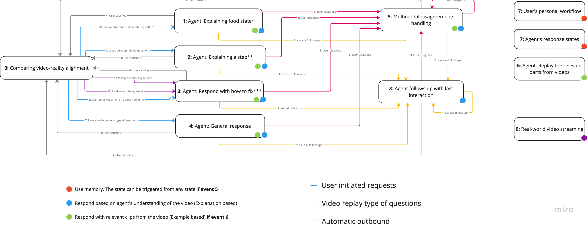

# Non-Visual Cooking (wip...)

A real-time cooking assistance system designed for visually impaired users, leveraging tutorial videos and computer vision.

## Overview

This system helps blind users cook in the kitchen by providing real-time guidance based on cooking tutorial videos. Users can carry their phone ahead of them to capture visual information while simultaneously engaging in voice interactions with the system.

### Key Features (for final version)

1. **User-Initiated Interactions**: Users can make speech requests at anytime to receive real-time responses from the agent and relevant video clips.
2. **System-Initiated Assistance**: Real-time responses based on visual information captured through the phone's camera.

### Codebase explanation

- **backend/**: Contains scripts for video parsing and knowledge extraction
  - Video parser that generates "video knowledge JSON" files offline.

- **cooking-react-next/**: Frontend Next.js application
  - Real-time video understanding
  - Voice interaction interface
  - State machine for managing cooking workflow
  - Capturing visual information from the phone's camera (based on Apple's continuity camera feature, thus requiring using IOS and Mac)

## Set up

1. Go to cooking-react-next

```
cd cooking-react-next
```

2. Install dependencies

```
npm install
```

3. Download images from [here](https://drive.google.com/drive/u/0/folders/1nOeiow9T0BNOHNN7t4_CLSnp_ObfGvcJ) and put it in `cooking-react-next/public`

4. Put the secret.json in `cooking-react-next` according to secret.json.example

5. Run the development server

```
npm run dev
```

## System Architecture



The system operates through a state machine architecture designed to provide contextual cooking assistance. Here's how it works:


### Interaction Types
1. **User-Initiated Requests** (Blue paths)
   - Food state questions
   - Step-related queries
   - General questions
   - Problem-solving requests

2. **System-Initiated Actions** (Purple paths)
   - Automatic detection of state misalignment
   - Missing step detection
   - Proactive assistance triggers

### Response Categories
- **Memory-Based** (🔴): Accesses interaction history for contextual responses
- **Explanation-Based** (🔵): Provides detailed understanding from video analysis
- **Example-Based** (🟢): Shows relevant video clips and demonstrations

## To play around (checkout the [demo](https://youtu.be/ECCIj8yQuVk))

1. Upload video knowledge JSON to the system.

2. You can type arbitrary comments in a text field to simulate speech requests for now.

3. You can also speak directly to the system to get response based on the current visual scene only (This is intended for realtime system-initiated assistance in the future.)

## TODO
1. Periodically make request to the real-time visual API to check the current cooking state. If error then raise an error message. (agent-initiated part)

2. Replace the textfield with direct voice input from the user.